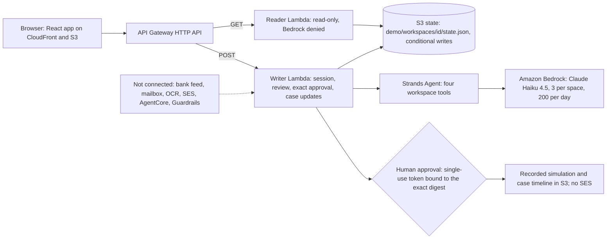

# Hestia: the household warranty and subscription sentinel

Hestia reads a household's receipts, subscriptions and repair records with a Strands agent on Amazon Bedrock, and nothing is sent until the household has approved the exact text.

Built for the AWS "Agents for Humans" hackathon, Everyday Agents track. The household is fictional (Athens Apartment 4B, homeowner Elena Georgiou). Approvals are recorded, never sent. Real recovered money is always EUR 0.00.

[Live demo](https://drusjukc9d4oc.cloudfront.net/) · [Health check](https://drusjukc9d4oc.cloudfront.net/healthz) · [Backend CI](https://github.com/upgradedev/hestia-aws/actions/workflows/ci.yml) · [Frontend CI](https://github.com/upgradedev/hestia-aws/actions/workflows/frontend-ci.yml) · [Architecture diagram](docs/architecture.svg) · [Devpost text](docs/DEVPOST_SUBMISSION.md) · [Video script](docs/VIDEO_SCRIPT_150S.md)

## Try it in 90 seconds

The live URL is a navigation link, not a deployment receipt. `GET /healthz` reports the deployed backend revision (`commit`) and whether the Strands agent may call Bedrock there (`live_model`). [PRIMARY: `curl https://drusjukc9d4oc.cloudfront.net/healthz`, 2026-09-13] the endpoint reported `commit` `b9149c77e7eb18b129df7bbfcc5c19d4241ca050` and `live_model` `false`, which is the release before this branch. The release of this branch goes through the workflows in [Deploy and verify](#deploy-and-verify); after it, `/healthz` reports the new commit and `live_model` `true`.

1. Open https://drusjukc9d4oc.cloudfront.net/ and click **Start with the sample household**. One click creates a private demo space (an HMAC capability valid for 30 minutes, `src/hestia/app/access.py:15`) with its own S3 workspace. No account, no login.
2. On **Home**, click **Ask Hestia to review this household**. A Strands agent calls four tools over the recorded facts and writes a briefing: what it checked, the decisions waiting for you, one suggested next step. The chips under the button show the mode (live model or deterministic checks), the model id, token usage and how many of the 3 model reviews remain for this space. Open **Tool trace** to read every tool call and its output.
3. Click **Review the exact notice**. The notice to Kotsovolos Megastore is prepared on the server from the recorded facts. You see the recipient, subject, the recorded repair cost (EUR 185.00) and the full text before you click **Approve this notice (recorded, not sent)**.
4. Click **Continue to the saved case and next step**. The case timeline shows the draft, the approval and the next step. Record a reply, a planning deadline, extra evidence or an outcome; each entry keeps who recorded it, when and from which source.
5. Open **About** for the list of what runs and what does not, and a read-only console that sends the same `GET /healthz` and `GET /api/state` requests the app sends.

What is real: the Lambda functions, the S3 workspace writes, the Bedrock model call through the Strands Agents SDK (when `live_model` is true), the session capability and the single-use approval token.
What is recorded, not executed: the notice approval (`delivery_status` `SIMULATED`, `ses_message_id` `null`), subscription cancellation requests, utility review requests, case replies (labelled manual or synthetic).
What is not connected: bank feeds (PSD2), mailbox or retailer sync, receipt OCR, email sending (SES), Bedrock AgentCore, Bedrock Guardrails.

## How Strands Agents is used

One sentence: the Strands agent is the reader. It calls bounded tools over one isolated workspace and writes the briefing; it never prepares, approves or sends the notice, and a guard withholds any sentence the tool outputs do not support.

| Piece | Where | What it does |
|---|---|---|
| Agent construction | `src/hestia/agents/household_agent.py:343-354` | `BedrockModel(model_id="eu.anthropic.claude-haiku-4-5-20251001-v1:0", region_name="eu-west-1", max_tokens=700, temperature=0.2, streaming=False)` inside `strands.Agent(model=..., tools=..., system_prompt=SYSTEM_PROMPT, callback_handler=None)` |
| Tools | `src/hestia/agents/household_agent.py:127-245` | Four plain callables built per workspace, wrapped with `strands.tool` so the schema comes from the signature and docstring: `review_repair_evidence(appliance_id)`, `audit_subscriptions()`, `check_receipts_and_utilities()`, `read_case_timeline()` |
| Prompt rules | `src/hestia/agents/household_agent.py:35-51` | The system prompt forbids stating entitlement, inventing deadlines or amounts, and drafting the notice; it fixes three headings and a 180-word ceiling. The review prompt names the recorded appliance ids and the review date |
| Trace and usage | `src/hestia/agents/household_agent.py:298-331` | Tool calls are paired from `agent.messages` (`toolUse` and `toolResult` blocks); token usage comes from `result.metrics.accumulated_usage` |
| Narrative guard | `src/hestia/agents/household_agent.py:53-75, 255-277` | Withholds the narrative when it matches an entitlement or deadline pattern, names an amount (with a currency mark) that no tool output contains, exceeds 3200 characters or omits the review boundary. The tool trace is shown regardless |
| Timeout and fallback | `src/hestia/agents/household_agent.py:334-389` | The agent runs in a worker thread with a 20 second limit; a timeout or exception returns the deterministic tools-only outcome with the reason (`model_timeout`, `model_error:<class>`), never invented text |
| Limits | `src/hestia/app/agent.py:21-84`, `src/hestia/adapters/storage.py:416-459` | 3 model calls per demo space (`state.agent_calls`), 200 per day through a conditional S3 counter at `demo/workspaces/_usage/agent-review-<day>.json` (`If-None-Match` on create, `If-Match` on update); an unconfirmed budget means no model call |
| Route | `src/hestia/app/api.py:329-330`, `src/hestia/app/api.py:279-292` | `POST /api/agent/review` needs the session capability; `GET /healthz` reports `live_model`, `model_id`, `framework`, `session_cap`, `daily_cap`, `max_output_tokens`; `live_send` is always `false` |
| IAM scope | `infra/hestia_api_stack.py:77-91, 240-242` | The writer role may call `bedrock:InvokeModel` and `bedrock:InvokeModelWithResponseStream` on that one inference profile and its foundation model only; the reader role denies `bedrock:*`; both deny `ses:*` and object deletes |
| Runtime | `scripts/deploy_api.py:26-27, 62-73` | The Lambda package bundles `strands-agents==1.53.0` and `boto3==1.43.93` and proves `from strands import Agent, tool` imports inside the bundle |
| UI | `frontend/src/components/AgentBriefing.tsx` | The briefing card renders the three sections without trusting model markup, the mode chips, the reason for a deterministic fallback, a withheld notice and the tool trace |
| Tests | `tests/test_household_agent.py` | Tool outputs without entitlement, Strands tool schemas from signatures, tools-only mode, guard rejections and acceptances, trace extraction, fallback on error and timeout, the conditional daily counter, session cap, daily cap, health reporting |

Directive (EU) 2019/771 is cited as general reference only. The tools return "review required" and never a determination of eligibility (`src/hestia/domain/warranties.py:192-248`).

## Architecture

The same picture with the boundaries drawn: [docs/architecture.svg](docs/architecture.svg). Narrative and evidence paths: [docs/BEDROCK_AGENTCORE_ARCHITECTURE.md](docs/BEDROCK_AGENTCORE_ARCHITECTURE.md) (the filename is historical; AgentCore is not connected).

## What runs where

[PRIMARY: repository inspection, 2026-09-13] Baseline before this wave: `b9149c77e7eb18b129df7bbfcc5c19d4241ca050`. Inspect the baseline with `git show b9149c77e7eb18b129df7bbfcc5c19d4241ca050:<path>` and this branch with `git show HEAD:<path>`; `git log b9149c77e7eb18b129df7bbfcc5c19d4241ca050..HEAD` lists the agent and UI commits on top of it. This is repository evidence, not a pipeline result or a live measurement.

| Surface | Mode on this branch | Evidence path | Boundary |
|---|---|---|---|
| Anonymous preview | Implemented: `GET /api/state` without a token returns the fresh synthetic household | `src/hestia/app/api.py:293-294` | Reading does not create a workspace |
| Demo space | Implemented: `POST /api/demo/session` issues a 30-minute HMAC capability and creates the workspace with `If-None-Match` | `src/hestia/app/access.py`, `src/hestia/adapters/storage.py:278-304` | A capability is not household identity |
| Strands review agent | Implemented on the writer Lambda; the stack sets `HESTIA_LIVE_MODEL=bedrock`; tools-only fallback with a visible reason | `src/hestia/agents/household_agent.py`, `src/hestia/app/agent.py`, `infra/hestia_api_stack.py:105-119` | Model output quality is unmeasured; a live call needs the deployed IAM and a confirmed daily budget |
| Notice preparation | Deterministic template bound to recipient, subject, amount, source revision and workspace | `src/hestia/app/claims.py:77-155`, `src/hestia/agents/tools.py:133-178` | The draft does not establish legal eligibility |
| Approval | Single-use token hashed server-side, digest compared in constant time, replay returns the same record, changed evidence rejected; result recorded as `SIMULATED` | `src/hestia/app/claims.py:158-224` | No delivery, no seller contact, no recovery |
| Case lifecycle | draft, review, authorized, pending_response, needs_information, rejected, resolved, reopen; replies labelled manual or synthetic; outcomes attested, capped at the recorded repair amount | `src/hestia/domain/cases.py:13-32`, `src/hestia/app/cases.py` | Attested amounts are not real recovery; `real_recovered_cents` stays 0 |
| Household rules | Date comparisons, subscription price and trial checks, receipt matching from EUR 50, utility baseline comparison | `src/hestia/agents/tools.py`, `src/hestia/domain/` | Thresholds are fixture assumptions |
| Manual import | Stage, review and commit of JSON facts or a validated PNG; hashes and reviewed facts retained | `src/hestia/app/intake.py`, `src/hestia/domain/ocr.py` | PNG bytes are validated, no text is extracted; OCR is not connected |
| Reader and writer | Two Lambda functions and roles; reader denies writes and Bedrock; both deny SES and deletes | `infra/hestia_api_stack.py`, `src/hestia/app/web.py:311-317` | Effective deployed IAM needs a release-bound check |
| Persistence | S3 adapter with `If-None-Match` creation and `If-Match` updates; CI uses the in-memory mode of the same class | `src/hestia/adapters/storage.py`, `scripts/ci_api_server.py` | Conditional writes and SHA-256 digests are not WORM storage |
| Health | `GET /healthz` reports commit, mode, `live_send` false, `live_model`, `model_id` and agent limits | `src/hestia/app/api.py:279-292` | A health field is configuration, not a measured call |
| Legacy toy route | `GET /api/simulation/mcts` still answers with `mode: illustrative`; the UI no longer shows it | `src/hestia/app/api.py:301-304` | No empirical rate behind it |
| Bank, mailbox, retailer feeds | Not connected | `src/hestia/adapters/storage.py:476-477`, `frontend/src/components/AboutView.tsx` | No PSD2 or mailbox adapter exists |
| SES | Not connected; direct dispatch route answers 403; IAM denies `ses:*` | `src/hestia/app/api.py:310-311`, `infra/hestia_api_stack.py:87-91` | Recorded approvals are not sent email |
| Bedrock AgentCore, Guardrails | Not connected | `docs/BEDROCK_AGENTCORE_ARCHITECTURE.md` | The narrative guard is a local pattern check, not a managed guardrail |

## Deploy and verify

Every workflow lives in `.github/workflows/`. Their presence is not a passing result: read the run for the tested revision.

| Workflow | Trigger | What it proves |
|---|---|---|
| `ci.yml` | pull requests; pushes to `main`, `build/**`, `codex/**`; manual dispatch | `ruff check`, `python tools/prose_gate.py`, `pytest --cov=hestia --cov-branch --cov-fail-under=85 tests/ infra/`, executed synthetic measurement and ablation retained as artifacts, the Lambda package built with the pinned Strands and boto3 versions, a health call inside the bundle without AWS access, and the rendered CloudFormation template with checksums |
| `frontend-ci.yml` | pull requests; pushes to `main`, `codex/**`; dispatch; reused by the deploy workflow | `tsc` and Vite build, Playwright journeys against `scripts/ci_api_server.py` (the real Lambda handler behind loopback HTTP), acceptance calibration in the frontend phase, Python hosting tests |
| `frontend-deploy.yml` | manual dispatch on `main` with an approved backend SHA | `infra/check_p0_backend.py` reads the live `/healthz` and requires the approved commit, `live_send` false and a named bounded model before publishing versioned assets to S3 and CloudFront; `infra/frontend_smoke.py` then checks headers, the commit marker, the paired backend SHA and that an anonymous approval is rejected |
| `production-acceptance.yml` | manual dispatch on `main`, backend phase first, then the paired frontend phase | `frontend/acceptance/p0-live.spec.ts` against the live URL: exact approval, replay, isolation between sessions and fail-closed legacy routes |

Backend release: `CI=true python scripts/deploy_api.py --approved-commit <sha> --demo-secret-arn <arn>` packages the runtime, uploads it under `releases/<sha>/` and prepares a CloudFormation change set with `--no-execute-changeset` (`scripts/deploy_api.py:119-136`). Executing the change set is a separate reviewed step; CloudFormation rolls the stack back if the update fails. The state bucket is retained across stack operations.

This branch (`claude/final-wave-20260913`) is outside the push triggers above, so its CI results come from a pull request or a manual dispatch. Coverage measured locally on 2026-09-13 with `python -m pytest --cov=hestia --cov-branch tests/ infra/` on Python 3.11 was 96.26%; that is a local measurement, not the CI figure. Read test counts and the CI coverage figure from the CI run, not from this file.

## Verification and testbook

The table defines the integrated regression testbook. The commands run in CI; their existence is not a passing result. Read the workflow checkout SHA and retained artifacts together. Automated checks do not complete deployed acceptance, legal review or independent human UAT (NOT_RUN).

| Requirement | Targeted regression evidence | Integration receipt |
|---|---|---|
| HE5 document bytes and manual correction | `tests/test_ocr.py`; `tests/test_intake.py::test_json_correction_exact_review_commit_and_reload_retain_real_input_provenance`; `frontend/tests/intake.spec.ts` JSON correction and reload journey | Backend JUnit plus browser HTTP state assertions; malformed bytes must fail without a draft |
| HE6 exact import, partial rows, dedupe and isolation | `tests/test_intake.py` partial-batch, stale digest, consent, cross-session, concurrent-write and lost-response tests; matching `frontend/tests/intake.spec.ts` journeys | Valid rows only after explicit subset consent; one persisted result after retry; no provider call |
| HE7 separate warranty facts and cautious wording | `tests/test_legal_guards.py` delivery and leap-day, statutory versus commercial, missing or contradictory facts, currency, draft tamper and current redress tests | JUnit proves technical guards, not legal eligibility |
| HE8 coherent facts and unknown versus zero | `tests/test_intake.py::test_canonical_metric_projection_ignores_stale_summary_and_uses_inclusive_threshold`; `frontend/tests/display-facts.spec.ts`; `frontend/tests/snapshot-consistency.spec.ts` | Backend record projection plus presentation fixtures with changed amounts, reload and keyboard navigation; real recovery stays zero |
| HE9 complete saved case journey | `tests/test_case_api.py`, `tests/test_case_lifecycle.py`, `frontend/tests/case-lifecycle.spec.ts` | CI HTTP journey: review, exact approval, follow-up, partial, rejected and resolved outcomes, replay; independent human acceptance remains separate |
| HE10 truthful claims and read-only console | `tests/test_claims_inventory.py` (README, docs, narration, the four UI copy files); `frontend/tests/claims-inventory.spec.ts` | Injected false copy must fail the Python guard. The browser spec still targets the previous About and Advanced pages and is being realigned to the rebuilt UI; until that lands, read the frontend CI run before citing it |
| HE10 executed synthetic measurement, not financial outcomes | `tests/test_measurement_truthfulness.py`; `tests/test_web.py` | The CI artifact holds executed measurement and ablation JSON with fixture fingerprints and a verification context; altered fixtures and historical overwrite attempts must fail |
| HE14 bounded Strands review | `tests/test_household_agent.py` | Tools-only mode, guard rejections, fallback on error and timeout, conditional daily counter, session cap, health reporting; a live Bedrock call is not exercised in CI |
| Preserved P0 authority and deployment contract | `frontend/tests/p0-session.spec.ts`, Python authority and storage tests, `frontend/acceptance/` | Negative gates and exact-content acceptance calibration; calibration is not an AWS deployment receipt |

The HE8 snapshot tests replace GET responses on purpose to test presentation; they are not backend-write evidence. Intake and case journeys use the CI HTTP API and persisted isolated state. `display-facts.spec.ts` holds pure-function Playwright cases, not browser journeys.

| CI scope | Command or workflow | Evidence required before reporting a result |
|---|---|---|
| Claims inventory and prose | `python -m pytest tests/test_claims_inventory.py`; `python tools/prose_gate.py` | Exact SHA, UTC time, JUnit and any failures |
| Browser claims | `npm --prefix frontend run test:e2e -- claims-inventory.spec.ts` | CI API and Vite harness, exact SHA, Playwright report |
| Backend regression | `.github/workflows/ci.yml` | Complete result including lint, tests, coverage and runtime packaging |
| Frontend regression | `.github/workflows/frontend-ci.yml` | Build, journeys, acceptance calibration |
| Independent human UAT | NOT_RUN | Named human protocol and attestation; automated browser work is not a substitute |

## Synthetic measurements

`tools/measure.py` and `tools/ablate.py` operate on synthetic fixtures. The historical `docs/measurement.json` and `docs/ablation.json` remain unchanged and were not regenerated for this branch: their recovery, exposure and delta labels describe synthetic amounts and rule assumptions, not real impact, seller confirmation or avoided household spending. `tests/test_measurement_truthfulness.py` pins them and refuses to overwrite them. Model accuracy, hallucination rate, cost per review, latency, time saved and merchant settlement rates are unmeasured for this revision. Any future measurement must name its command, input sample, exact SHA, UTC time and retained output.

## Prior work

`infra/frontend_stack.py` (the CloudFront and S3 hosting template, which serves several of the author's products) and the video tooling in `video/`, `web/video/` and `scripts/verify_video_sync.py` were written by the same author for earlier projects and reused here. Everything else in this repository was written for Hestia. Business logic follows the text of Directive (EU) 2019/771 and general household bookkeeping practice; no customer or private data was used.

## License

MIT. See [LICENSE](LICENSE). `pyproject.toml` declares the same license.
