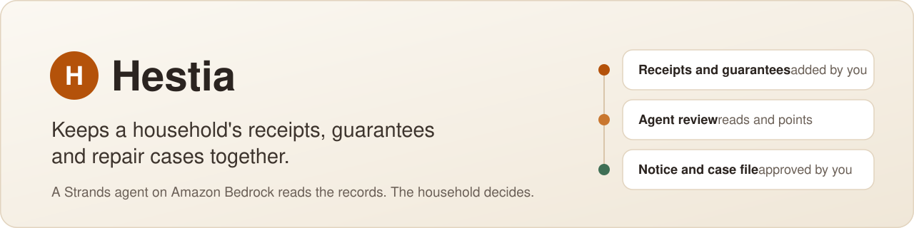
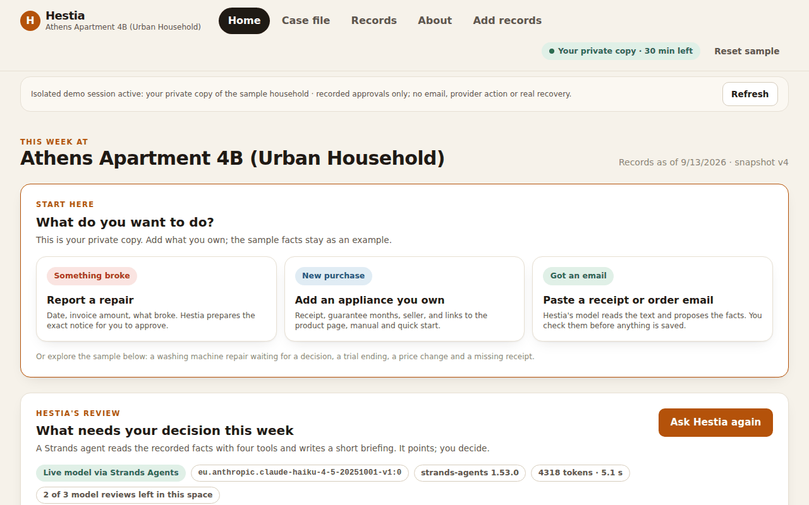

# Hestia



[](https://github.com/upgradedev/hestia-aws/actions/workflows/ci.yml)
[](https://github.com/upgradedev/hestia-aws/actions/workflows/frontend-ci.yml)
[](LICENSE)


[](docs/strands-agents.md)
[](docs/architecture.md)

Hestia is an everyday agent for the paperwork a household never keeps together: receipts, guarantees, subscriptions and repair bills. A Strands agent on Amazon Bedrock reads the household's records and points at the decisions waiting. The household reads the exact notice and approves it, and nothing is ever sent.

**[Open the live demo](https://drusjukc9d4oc.cloudfront.net/)** · [Judge walkthrough](docs/devpost-submission.md#testing-instructions-for-judges) · [Architecture](docs/architecture.md) · [Strands Agents](docs/strands-agents.md)

Built for the AWS Agents for Humans hackathon, Everyday Agents track.

> **Demo data only.** The household is fictional and its amounts are synthetic. Approvals are recorded, never sent, and no money moves.



## Try it

1. Open the [live demo](https://drusjukc9d4oc.cloudfront.net/) and choose **Start with the sample household**. You get a private copy for 30 minutes, with no account.
2. Under **Start here**, report a repair, add an appliance, or paste a receipt or order email. Nothing is saved until you check and confirm it.
3. Choose **Ask Hestia to review this household**. The agent reads the records through four tools and writes a short briefing. **Tool trace** shows every call.
4. Choose **Review the exact notice**, read it, then choose **Approve this notice (recorded, not sent)**.
5. Follow the saved case through replies, deadlines, evidence and outcomes. **About** lists what runs and what does not.

Step-by-step checks for judges are in [the Devpost text](docs/devpost-submission.md#testing-instructions-for-judges).

## How it works


The agents read; the household decides.

- **Review agent.** A Strands agent with four read-only tools writes a short briefing. A guard withholds any briefing that claims an entitlement or names an amount no tool returned. Without the model, the same tools run on their own and the page says why.
- **Reading agent.** A second Strands agent, with no tools, turns pasted receipt or order text into proposed records. The household confirms them in the same form as a manual entry.
- **Plain code where it matters.** The notice, the single-use approval and every case step are deterministic Python. The approval is recorded as a simulation, and email sending is not connected.
- **Bounded.** 3 reviews and 3 readings per private copy, 200 reviews and readings a day across all visitors, 700 output tokens and a 20-second timeout.

Built with React 19 and Vite, Amazon CloudFront, Amazon API Gateway, AWS Lambda on Python 3.11, Amazon S3, Amazon Bedrock with Claude Haiku 4.5, Strands Agents, AWS CloudFormation and GitHub Actions. Details: [how the agents work](docs/strands-agents.md) and [the full architecture](docs/architecture.md).

## What is real

| Capability | Status |
|---|---|
| Strands review and reading agents on Amazon Bedrock | Live |
| Appliances, repairs and imported records | Live; saved only after the household confirms |
| Notice preparation and approval | Live; the approval is recorded as a simulation |
| Case file with replies, deadlines and outcomes | Live; outcomes are reported by the household |
| One private copy per visitor, stored in Amazon S3 | Live |
| Email sending through Amazon SES | Not connected; IAM denies it |
| Bank feeds, mailbox or retailer sync, receipt photo OCR | Not connected |
| Amazon Bedrock AgentCore and Bedrock Guardrails | Not connected |

Briefing quality and extraction accuracy are unmeasured, and no independent human testing has been run (NOT_RUN). Each mode with its code and evidence is in [docs/architecture.md](docs/architecture.md#what-runs-where).

## Run it locally

You need Python 3.11, and Node 22 for the web app.

```bash
pip install -e ".[dev]"
python -m pytest
```

To click through the app, start the real API handler with in-memory state and the Vite dev server, then open <http://127.0.0.1:3000>. There is no model locally, so a review runs the tools on their own.

```bash
cd frontend && npm ci && cd ..
CI=true python scripts/ci_api_server.py --port 8000 &
npm --prefix frontend run dev -- --port 3000 --strictPort
```

Tests and CI are described in [docs/testing.md](docs/testing.md), and releasing to AWS in [docs/deployment.md](docs/deployment.md).

## Documentation

| Document | What it covers |
|---|---|
| [Architecture](docs/architecture.md) | AWS resources, request flow, what runs where, trust boundaries |
| [Strands Agents](docs/strands-agents.md) | both agents, their tools, guard, limits and permissions |
| [Testing](docs/testing.md) | local checks, CI, the test suites and the integration testbook |
| [Deployment](docs/deployment.md) | the release runbook and the evidence for the deployed revision |
| [Assurance](docs/assurance.md) | open gaps, the legal boundary, data handling and provenance |
| [Devpost text](docs/devpost-submission.md) | the submission text and the judge walkthrough |
| [Builder article](docs/builder-aws-article.md) | a draft article on the design |
| [Video script](docs/video-script.md) | the demo video beats and production notes |

## License

MIT. See [LICENSE](LICENSE).
