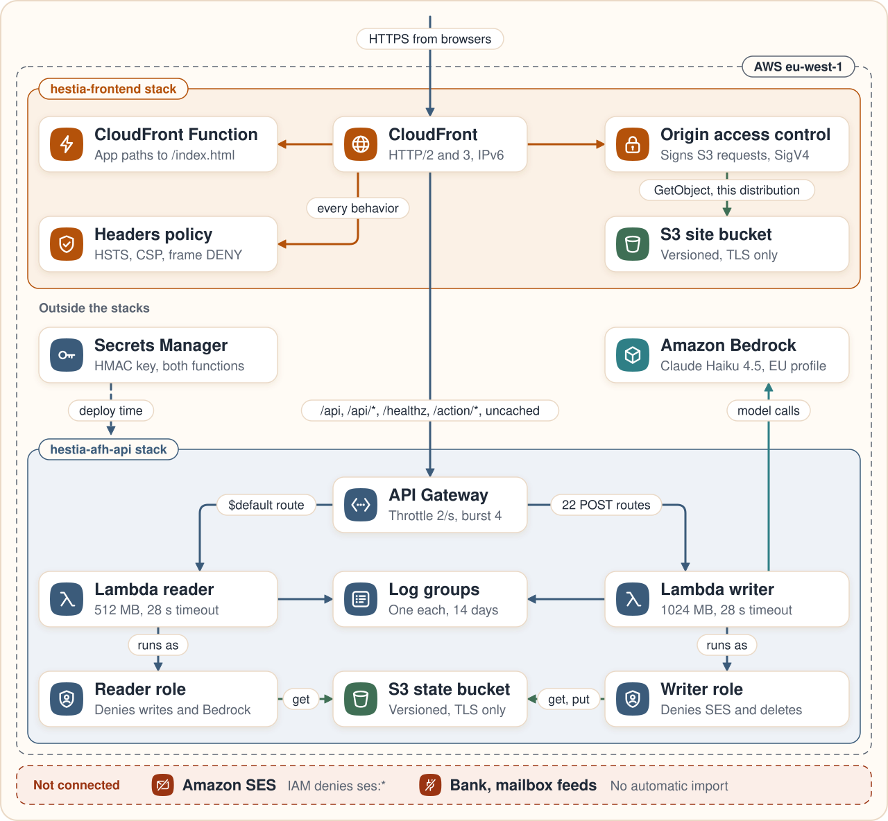
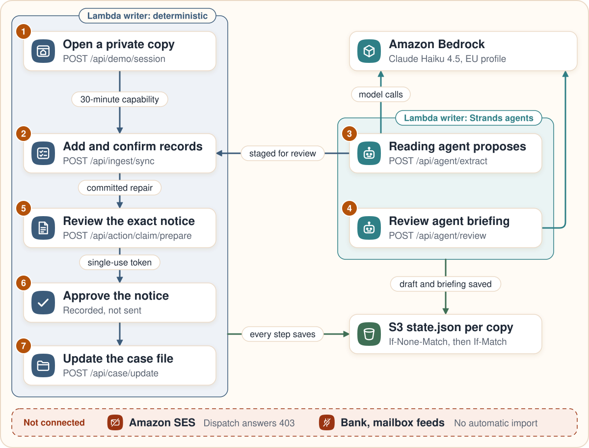

# Architecture

Hestia is a React app on Amazon CloudFront and an API on AWS Lambda. Two Strands agents on Amazon Bedrock read the household's records. Everything that touches money, law or the case file is deterministic Python behind an explicit human approval, and nothing is sent: Amazon SES is not connected.

There are two drawings:

- [assets/infrastructure.svg](assets/infrastructure.svg) shows the AWS resources in the two CloudFormation stacks and the release path.
- [assets/request-flow.svg](assets/request-flow.svg) follows a request from the browser to the approval gate, and shows where it stops.



Line references point at the source on `main`. The deployed revision and its evidence are in [deployment.md](deployment.md).

## Request path

1. The browser loads the app from CloudFront. The default behavior reads the private S3 site bucket through Origin Access Control, a CloudFront Function rewrites app navigations to `/index.html`, and `/assets/*` is cached (`infra/frontend_stack.py:15-23, 137-176`).
2. The app calls same-origin paths. CloudFront forwards `/api/*`, `/api`, `/healthz` and `/action/*` to the API Gateway HTTP API with caching disabled (`infra/frontend_stack.py:48-58`).
3. API Gateway sends 22 explicit POST routes to the writer function and everything else, through the `$default` route, to the reader function. The reader refuses any method other than GET or OPTIONS with 405 (`infra/hestia_api_stack.py:204-218, 273-288`, `src/hestia/app/web.py:311-317`). The stage throttles at 2 requests per second with a burst of 4.
4. `POST /api/demo/session` issues a 30-minute HMAC capability and creates the private copy with `If-None-Match` (`src/hestia/app/access.py:15-61`, `src/hestia/adapters/storage.py:284-310`). Protected routes need it as a bearer token.
5. The writer reads and writes one `state.json` per private copy with conditional requests; the reader only reads it (`src/hestia/adapters/storage.py:247-404`).
6. The writer calls Amazon Bedrock through the two Strands agents, described in [strands-agents.md](strands-agents.md).



## The household flow

```text
Start with the sample household   POST /api/demo/session          a 30-minute private copy in S3
Add records by hand               POST /api/ingest/sync           stage, review, consent, commit
Paste a receipt or order email    POST /api/agent/extract         reading agent; a staged draft only
Ask Hestia to review              POST /api/agent/review          review agent; briefing and trace
Review the exact notice           POST /api/action/claim/prepare  deterministic notice; case file opened
Approve (recorded, not sent)      POST /api/action/claim          single-use token; SIMULATED record
Add a case update                 POST /api/case/update           replies, deadlines, evidence, outcomes
```

This is the source topology, not a recorded trace. Approval sends no email, cancels nothing and recovers no money.

## Components

| Component | What it does | Source | Limit |
|---|---|---|---|
| Session capability | a 30-minute HMAC token bound to one private copy, with no account | `src/hestia/app/access.py` | a capability is not a household identity |
| Household registry | the `appliance` and `repair` intake kinds add the household's own items and repairs through stage, review, consent and commit. A committed repair lets the household prepare the notice; a second repair on the same appliance is refused while its claim is open | `src/hestia/domain/intake.py:50-135` | guarantee months are screening inputs; saved links are the household's own and are never generated |
| Manual import | JSON facts, or a validated PNG, through the same stage, review and commit | `src/hestia/app/intake.py`, `src/hestia/domain/ocr.py` | no text is read from an image |
| Review agent | four read-only tools, a briefing under three headings, a pattern guard and a tools-only fallback | `src/hestia/agents/household_agent.py` | briefing quality is unmeasured |
| Reading agent | proposes records from pasted text; the route stages them as a draft | `src/hestia/agents/household_agent.py:400-448`, `src/hestia/app/agent.py:97-170` | extraction accuracy is unmeasured; a person confirms every fact |
| Notice preparation | a deterministic template bound to the recipient, subject, amount, source revision and private copy; it opens the case file in review | `src/hestia/app/claims.py:77-155`, `src/hestia/agents/tools.py:133-178` | the draft does not establish legal eligibility |
| Approval | a single-use token stored as a hash, the digest compared in constant time, and a replay that returns the same record; the record is `SIMULATED` with `ses_message_id` null | `src/hestia/app/claims.py:158-224` | no delivery, no seller contact, no recovery |
| Case timeline | draft, review, authorized, pending response, needs information, rejected, resolved and reopen; updates labelled manual or synthetic; outcomes attested and capped at the recorded repair amount | `src/hestia/domain/cases.py`, `src/hestia/app/cases.py` | attested amounts are not real recovery; `real_recovered_cents` stays 0 |
| Household rules | date comparisons, subscription price and trial checks, receipt matching from EUR 50, a utility baseline comparison | `src/hestia/agents/tools.py`, `src/hestia/domain/` | thresholds are fixture assumptions |
| Persistence | one `state.json` per private copy of at most 262144 bytes, `If-None-Match` on create and `If-Match` on update, audit events inside the same write, and an in-memory mode for CI | `src/hestia/adapters/storage.py` | conditional writes and digests are not WORM storage |
| Health | `GET /healthz` reports the commit, `live_send` false, `live_model`, `model_id` and the agent limits | `src/hestia/app/api.py:280-294` | configuration, not a measured call |

## AWS resources

Both stacks are deployed in `eu-west-1`.

| Stack | Resource | Configuration |
|---|---|---|
| `hestia-frontend` | S3 site bucket | private, versioned, SSE-S3, public access blocked, TLS only, readable only by this distribution, retained if the stack is deleted |
| | CloudFront distribution | HTTP/2 and HTTP/3, price class 100, the default certificate; a response headers policy with HSTS, a content security policy, `X-Frame-Options: DENY`, `nosniff` and `no-referrer` on every behavior |
| | CloudFront Function | rewrites app navigations to `/index.html` on the default behavior |
| | IAM release role | assumed through GitHub OIDC from the `main` branch of this repository; may put site files, invalidate this distribution and describe the stack; no delete action |
| `hestia-afh-api` | API Gateway HTTP API | the `$default` route to the reader, 22 POST routes to the writer, 28-second integrations, throttling at 2 requests per second with a burst of 4 |
| | Writer function `hestia-afh-api` | Python 3.11, x86_64, 1024 MB, a 28-second timeout, reserved concurrency 2 |
| | Reader function `hestia-afh-reader` | the same package and settings with 512 MB and the read-only handler |
| | Writer role | S3 get and put under `demo/workspaces/`, its own log group, and Bedrock on one inference profile and its foundation model; denies SES and object deletes |
| | Reader role | S3 get under `demo/workspaces/` and its own log group; denies puts, deletes, SES and Bedrock |
| | S3 state bucket | versioned, SSE-S3, public access blocked, TLS only, retained if the stack is deleted; noncurrent versions expire after 30 days |
| | CloudWatch Logs | one log group per function with 14-day retention |
| Outside the stacks | S3 deploy bucket | holds `releases/<sha>/hestia-api.zip`, from which CloudFormation loads the function code |
| | AWS Secrets Manager | the HMAC signing key, resolved by CloudFormation into the functions' environment at deploy time; the functions never call Secrets Manager |
| | Amazon Bedrock | the `eu.anthropic.claude-haiku-4-5-20251001-v1:0` inference profile, called from `eu-west-1` |

## What runs where

| Surface | Mode | Source | Boundary |
|---|---|---|---|
| Anonymous preview | `GET /api/state` without a token returns a fresh synthetic household | `src/hestia/app/api.py:295-296` | reading does not create a private copy |
| Private copy | `POST /api/demo/session` issues the capability and creates the copy | `src/hestia/app/access.py`, `src/hestia/adapters/storage.py:284-310` | 30 minutes and 40 actions; no recovery across devices |
| Review agent | live on the writer when `HESTIA_LIVE_MODEL=bedrock`, which the stack sets; a tools-only fallback with a visible reason | `src/hestia/agents/household_agent.py`, `src/hestia/app/agent.py` | briefing quality is unmeasured |
| Reading agent | live on the writer under the same setting; fails closed | `src/hestia/app/agent.py:97-170` | extraction accuracy is unmeasured |
| Household registry and manual import | implemented; reviewed before saving | `src/hestia/domain/intake.py`, `src/hestia/app/intake.py` | facts are what the household typed or confirmed |
| Notice approval | recorded as a simulation | `src/hestia/app/claims.py` | never sent |
| Subscription and utility requests, receipt links | recorded in the private copy | `src/hestia/app/api.py:155-238` | no provider is contacted |
| Case timeline | implemented | `src/hestia/app/cases.py` | outcomes are attested, not verified |
| Email through Amazon SES | not connected; the dispatch route answers 403 and IAM denies `ses:*` | `src/hestia/app/api.py:312-313`, `infra/hestia_api_stack.py:88-92` | recorded approvals are not sent email |
| Bank feeds, mailbox and retailer sync | not connected | `src/hestia/adapters/storage.py:476-492` | pasting the text of an email reads no mailbox |
| Receipt OCR from an image | not connected; PNG bytes are only validated | `src/hestia/domain/ocr.py` | no text is read from an image |
| Bedrock AgentCore, Bedrock Guardrails, action groups | not connected | no reference in `src/`, `infra/` or `scripts/` | the narrative guard is a local pattern check |
| Legacy illustration | `GET /api/simulation/mcts` answers with `mode: illustrative` and `empirical_success_rate: null`; the UI does not show it | `src/hestia/app/api.py:303-306` | no empirical rate behind it |

## Trust boundaries

- **The capability isolates private copies in code, not in IAM.** Both roles may read any object under `demo/workspaces/`, and the HMAC capability decides which copy a request touches (`infra/hestia_api_stack.py:65-69, 235-236`, `src/hestia/app/api.py:310-314`).
- **The reader cannot write or call the model.** Its role denies `s3:PutObject`, deletes, `ses:*` and `bedrock:*`, and its handler refuses anything but GET and OPTIONS.
- **The agents cannot change records.** Neither has a write tool. The routes store the briefing and the staged draft, and household records change only through a reviewed commit with `confirmed: true`.
- **The notice is not model text.** `draft_statutory_claim_letter` builds it from recorded facts, and the approval binds its exact digest.
- **`/healthz` describes configuration.** The reader answers it from the writer's environment, so `live_model` true does not prove a model call.

## Data and retention

- One `state.json` per private copy holds the household's records, staged drafts with proposed records, briefings with tool traces, the case file and the audit events.
- The template's 90-day expiry rule matches only the `audit/` prefix, which the application never writes, so current private copies do not expire. Noncurrent versions expire after 30 days. Both roles deny deletes, so there is no erasure path at runtime. See [assurance.md](assurance.md).
- The only application log line is a JSON line written when a text reading fails. Neither template configures API Gateway access logs or CloudFront logs.

## Verification boundary

Repository source, CI synthetic runs, live read-only checks, production acceptance and human attestation are separate levels of evidence. CI never calls Bedrock: `tests/test_household_agent.py` and `tests/test_registry_intake.py` cover both model routes with fakes. The production acceptance run calls the deployed model ([deployment.md](deployment.md)). Latency, cost, briefing quality and extraction accuracy cannot be read from this architecture, and those figures are unmeasured. CI measures branch coverage against an 85% gate, and the figure comes from the run ([testing.md](testing.md)). Independent human UAT is NOT_RUN. The test map is in [testing.md](testing.md).
