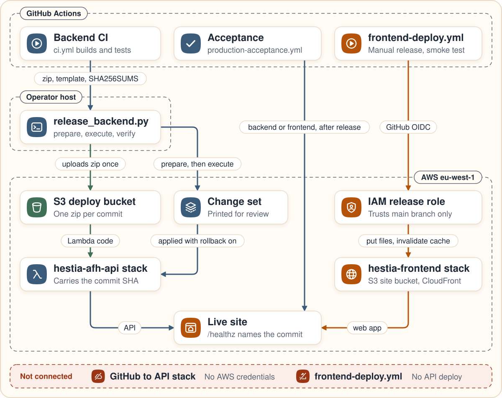

# Deployment and release evidence

Hestia runs on AWS as two CloudFormation stacks: `hestia-frontend` serves the web app and `hestia-afh-api` serves the API. The resources are drawn and described in [architecture.md](architecture.md), and how each check works is in [testing.md](testing.md). The drawing below follows a change from CI to the live site.



## Deployed revision

Checked on 2026-09-14 against `GET https://drusjukc9d4oc.cloudfront.net/healthz` and the workflow runs below: the web app and both Lambda functions run `489b9366b4dc1c1a5ea3b6c612db90da694782e2`. Health reports `live_model` true, `model_id` `eu.anthropic.claude-haiku-4-5-20251001-v1:0` and `strands-agents 1.53.0`. Inspect that source with `git show 489b9366b4dc1c1a5ea3b6c612db90da694782e2:<path>`.

| Gate | Evidence |
|---|---|
| Backend CI on `main`, source of the release artifact | [run 34829791206](https://github.com/upgradedev/hestia-aws/actions/runs/34829791206) |
| Backend release | change set executed with rollback on; both functions report the commit and the same code hash |
| Backend acceptance, 5 API cases | [run 34830739523](https://github.com/upgradedev/hestia-aws/actions/runs/34830739523) |
| Frontend release | [run 34830741939](https://github.com/upgradedev/hestia-aws/actions/runs/34830741939) |
| Paired acceptance, 5 API and 2 browser cases | [run 34831257412](https://github.com/upgradedev/hestia-aws/actions/runs/34831257412) |
| Independent human UAT (user acceptance testing) | NOT_RUN |

`main` can be ahead of the deployed revision; `/healthz` always names the deployed commit.

A green run proves the checks it runs against the revision it names. Briefing quality, extraction accuracy, latency and cost are unmeasured.

## Backend release

The backend is released from an operator host with `scripts/release_backend.py`. No workflow holds AWS credentials for the API stack.

1. Merge to `main`. `ci.yml` builds the `backend-runtime-candidate` artifact: the Lambda zip with `strands-agents==1.53.0` and `boto3==1.43.93`, the rendered template and `SHA256SUMS`.
2. Prepare:

   ```bash
   python scripts/release_backend.py --sha <40-hex sha> --run-id <main CI run id> prepare
   ```

   It downloads the artifact only from a successful `main` run for that exact SHA, verifies the checksums, uploads the zip once to `releases/<sha>/hestia-api.zip` in the deploy bucket, reads it back and compares it, and prepares a CloudFormation change set without executing it.
3. Read the change set, then run the execute step. It downloads and checks the same artifact again and prepares a new change set from it. It prints that change set, refuses it if it removes or replaces a resource, executes it without pausing, and then runs the verify step. CloudFormation rolls the stack back if the update fails.

   ```bash
   python scripts/release_backend.py --sha <40-hex sha> --run-id <main CI run id> --execute execute
   ```

4. Verify that both functions report the commit and the uploaded code hash, and that the public `/healthz` names the commit with `live_send` false:

   ```bash
   python scripts/release_backend.py --sha <40-hex sha> verify
   ```

`scripts/deploy_api.py` is the packager CI calls; it refuses to run unless `CI=true`.

## Frontend release

`frontend-deploy.yml` runs its verification job on every push to `main`. The release job runs only on a manual dispatch on `main` with `approved_backend_sha`:

1. `infra/check_p0_backend.py` reads the live `/healthz` and requires the approved commit, `status` ok, `mode` simulated, `live_send` false, `live_model` true with a named model, and configured storage and sessions.
2. The job builds the app, assumes the `hestia-frontend-release` role through GitHub OIDC, and `infra/frontend_publish.py` uploads every file under `releases/<sha>/` and at its live key, then invalidates the CloudFront cache. It never deletes a file.
3. `infra/frontend_smoke.py` checks the `X-Content-Type-Options` and `X-Frame-Options` headers, the commit marker in the HTML, the paired backend commit, and that an unauthenticated approval is refused with 401.

## Production acceptance

`production-acceptance.yml` runs `frontend/acceptance/p0-live.spec.ts` against the live URL on a manual dispatch on `main`. Its `approved_sha` input must equal the workflow revision.

| Phase | Cases |
|---|---|
| `backend` | the 5 API cases below |
| `frontend` | the same 5 API cases and the 2 browser cases below |

API cases:

1. Exact approval, replay, isolation, agent review and closed legacy routes.
2. Protected case updates through an attested outcome.
3. Manual intake.
4. A subscription request replay.
5. The household registry with a live text reading.

Browser cases, frontend phase only:

1. The exact notice and agent review with history after reload.
2. A cold start through a saved next step, with a return on a phone-sized screen.

The workflow does not enforce the order. Run the backend phase after a backend release and the frontend phase after the web app release.

## Resources that outlive a stack

The state bucket and the site bucket are retained if their stack is deleted. Release files stay under `releases/<sha>/` in the deploy bucket and in the site bucket.
