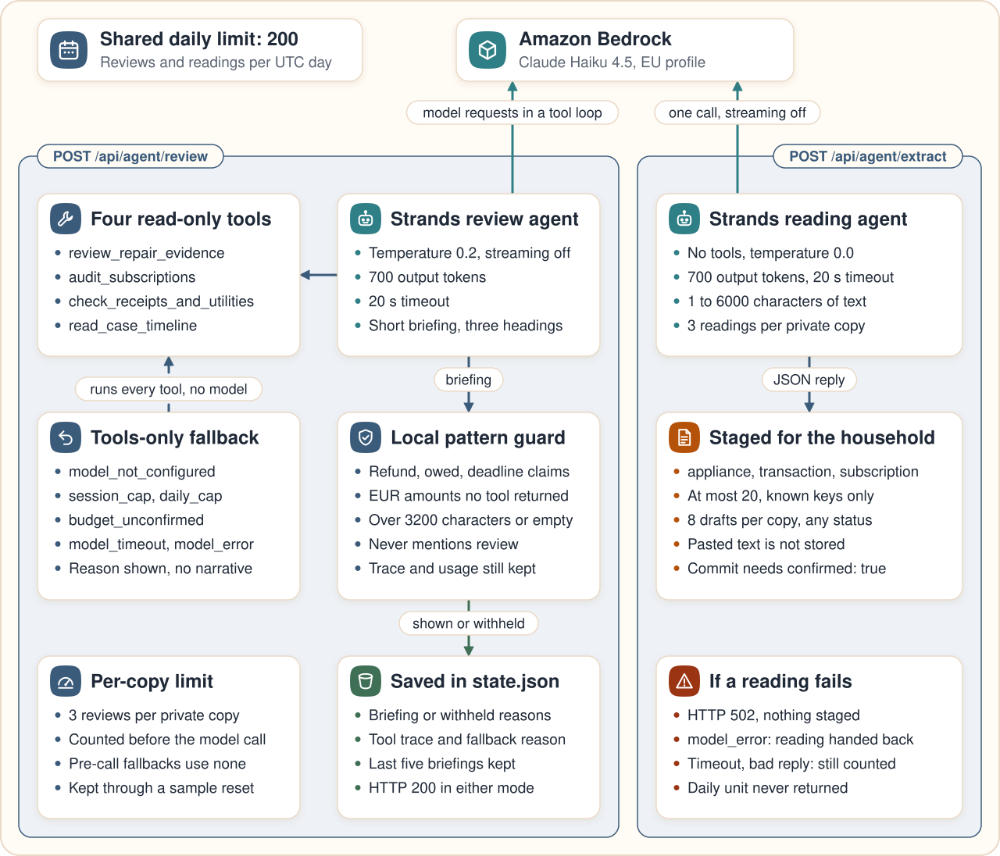

# How Hestia uses Strands Agents

Hestia runs two agents built with the Strands Agents SDK on Amazon Bedrock. Both run inside the writer Lambda function. Neither agent has a tool that writes records, prepares a notice or sends anything: the agents read, and the household decides.

| Agent | Route | Tools | Output | What happens to the output |
|---|---|---|---|---|
| Review agent | `POST /api/agent/review` | four read-only tools over one private copy | a short briefing under three headings | stored with the private copy and shown beside the tool trace |
| Reading agent | `POST /api/agent/extract` | none | a JSON object of proposed records | staged as a draft that the household corrects, confirms and commits |



Line references point at the source on `main`. [deployment.md](deployment.md) records which revision is live.

## The review agent

**Construction** (`src/hestia/agents/household_agent.py:474-485`). Each review builds one agent and asks it once to use every tool and write the briefing:

```python
model = BedrockModel(
    model_id=model_id, region_name=region_name, max_tokens=max_tokens,
    temperature=0.2, streaming=False,
)
return Agent(
    model=model, tools=strands_tools(state, today), system_prompt=SYSTEM_PROMPT,
    callback_handler=None,
)
```

The defaults are `eu.anthropic.claude-haiku-4-5-20251001-v1:0`, `eu-west-1` and 700 output tokens (`household_agent.py:27-33`). On the route they come from `HESTIA_BEDROCK_MODEL_ID`, `HESTIA_BEDROCK_REGION` and `HESTIA_AGENT_MAX_TOKENS` (`src/hestia/app/agent.py:34-47`), and the stack sets the same values (`infra/hestia_api_stack.py:111-117`). A model id is only configured when `HESTIA_LIVE_MODEL` is `bedrock`.

**Tools** (`household_agent.py:155-280`). Four closures over the loaded private copy and the review date, wrapped with `strands.tool`, so the schema the model reads comes from the signature and the docstring:

| Tool | Reads | Returns |
|---|---|---|
| `review_repair_evidence(appliance_id)` | one appliance, its seller and any saved case | recorded dates, screening boundaries, missing facts and review flags under "REVIEW REQUIRED" |
| `audit_subscriptions()` | active subscriptions | trial, price change and duplicate findings |
| `check_receipts_and_utilities()` | card transactions and utility bills | missing receipts and bills above their baseline |
| `read_case_timeline()` | saved cases | status, planning deadline, next step and the last three events |

Each tool output is clipped to 1600 characters.

**Prompt** (`household_agent.py:34-51`). The system prompt tells the agent to use the tools instead of guessing, never to state or imply entitlement to a refund, repair or amount, never to invent deadlines, statutory periods or attachments, to use only amounts and dates from tool outputs, and not to draft the notice. It asks for fewer than 180 words under exactly three headings: What I checked, Decisions waiting for you, Suggested next step. The review prompt names the recorded appliance ids and the review date. The word ceiling is an instruction; the code enforces a 3200-character limit.

**Trace and usage** (`household_agent.py:326-345, 451-462`). Tool calls are paired from the `toolUse` and `toolResult` blocks in `agent.messages`, and token usage comes from `result.metrics.accumulated_usage`. Both are stored with the briefing; the private copy keeps its last five briefings.

**Guard** (`household_agent.py:31, 81-102, 283-305, 511-518`). A local pattern check withholds the whole briefing when it:

- matches a banned pattern: entitlement, refund or reimbursement promises, "owed" or "due", deadline wording, or a recovered EUR amount;
- names a EUR amount that matches no number in the outputs of the tools it called (dates are ignored, and whole numbers are also read as cents);
- exceeds 3200 characters, never mentions review, or is empty.

The tool trace and usage are still returned. The guard is not Amazon Bedrock Guardrails, and a wording its patterns miss would pass.

**Timeout and fallback** (`household_agent.py:308-323, 487-509`). The agent runs in a worker thread joined for 20 seconds. A timeout returns the deterministic tools-only outcome with reason `model_timeout`, and an exception returns it with `model_error:<ExceptionClass>`. The worker thread is not stopped and the attempt stays counted. Before any call, the route also falls back with `model_not_configured`, `session_cap`, `budget_unconfirmed` or `daily_cap` (`src/hestia/app/agent.py:50-94`). Tools-only mode writes no narrative: the page shows the reason and the output of every tool call, and the route answers HTTP 200 either way. `review_repair_evidence` runs once for each appliance with a recorded repair, and the other three tools run once each.

## The reading agent

**Construction** (`household_agent.py:400-448`). A second `Agent` with `tools=[]`, `EXTRACT_PROMPT` and `BedrockModel(..., temperature=0.0, streaming=False)`. The user message is the document type hint followed by the pasted text.

**Prompt and shape** (`household_agent.py:53-79, 360-397`). The prompt asks for `{"records": [...]}` and nothing else, a field only when the text states it, no guessed date, price, email or model number, integer cents and at most 20 records. The reply is read from the first `{` to the last `}`, then `normalise_extracted` keeps at most 20 records, only the kinds below, only their keys and only plain values:

| Kind | Allowed keys |
|---|---|
| `appliance` | `appliance_id`, `item_name`, `brand`, `model_number`, `serial_number`, `purchase_date`, `purchase_price_cents`, `seller_name`, `seller_email`, `receipt_reference` |
| `transaction` | `transaction_id`, `merchant`, `amount_cents`, `date`, `category` |
| `subscription` | `subscription_id`, `service_name`, `category`, `monthly_cents`, `last_billed`, `is_trial`, `trial_end_date`, `previous_monthly_cents` |

A failed reading carries the reason `model_timeout`, `model_error:<ExceptionClass>` or `unparseable_reply`. A reply that parses but holds no valid record is staged as an empty proposal.

**Route** (`src/hestia/app/agent.py:97-170`, `src/hestia/app/api.py:63, 333-334`). `POST /api/agent/extract` needs the session capability. The body is `{"text": "..."}` with an optional `hint` of `auto` (the default), `receipt`, `order` or `statement`.

| Answer | When |
|---|---|
| 200 with `replayed: false` | a new reading, staged as a draft |
| 200 with `replayed: true` | this private copy already read the same text; no model call and no reading used |
| 400 | missing or empty text, more than 6000 characters, control characters, an unknown hint or an extra field |
| 401 | no valid session capability |
| 429 | 3 readings already used in this private copy, 8 intake drafts in any status (committed ones count), or the 40-action limit |
| 502 | the model timed out, failed or returned an unreadable reply |
| 503 | no model configured, or the shared daily budget is spent or cannot be confirmed |

**What is stored** (`agent.py:154-168`). The staged draft keeps the SHA-256 of the text, its byte count, the proposed records, the model id, token usage and duration, with source `model_text_extraction`, `ocr_status` `model_text` and route `/api/ingest/sync`. The pasted text itself is not stored. Nothing reaches the household records until the household reviews the draft and commits it with `confirmed: true` (`src/hestia/app/intake.py:52, 69-70`).

**When a reading fails** (`agent.py:137-153`). The route records an `agent_extract` audit event with `reading_counted`, prints one JSON line to CloudWatch Logs and answers 502. A failure raised by the model call (`model_error:<ExceptionClass>`, such as a Bedrock service error) hands the reading back; a timeout or an unreadable reply stays counted. The unit taken from the shared daily budget is not returned in either case.

## Limits

| Limit | Value | Source |
|---|---|---|
| Reviews per private copy | 3, counted before the call (`state.agent_calls`) | `src/hestia/app/agent.py:28-31, 58-76` |
| Text readings per private copy | 3 (`state.agent_extracts`) | `src/hestia/app/agent.py:123-136` |
| Shared daily budget | 200 reviews and readings per UTC day, both agents together; one review can make several model requests in its tool loop | `src/hestia/adapters/storage.py:422-474` |
| Output tokens | 700 per call | `infra/hestia_api_stack.py:111-117` |
| Model call timeout | 20 seconds; the Lambda and API Gateway limits are 28 seconds | `household_agent.py:32`, `infra/hestia_api_stack.py:103, 136` |
| Pasted text | 6000 characters | `src/hestia/app/agent.py:104-106` |

The daily budget is one S3 object per day, `demo/workspaces/_usage/agent-review-<day>.json`. The first call of the day creates it with `If-None-Match: *`, later calls increment it with `If-Match` on its ETag, and a lost race retries up to four attempts. When the count cannot be confirmed, no model call is made. The counters survive a reset of the sample.

## Permissions

The writer role allows `bedrock:InvokeModel` and `bedrock:InvokeModelWithResponseStream` on the `eu.anthropic.claude-haiku-4-5-20251001-v1:0` inference profile in the stack's account and region, and on the matching foundation model in any region (`infra/hestia_api_stack.py:78-92`). Both agents call the model with `streaming=False`. The reader role, which answers every GET including `/healthz`, denies `bedrock:*` (`infra/hestia_api_stack.py:232-246`). Both roles deny `ses:*` and object deletes.

## Runtime version and health

The Lambda package bundles `strands-agents==1.53.0` and `boto3==1.43.93`, and checks inside the bundle that `Agent`, `tool` and `BedrockModel` import (`scripts/deploy_api.py:26-27, 62-81`). CI test jobs install the floors from `pyproject.toml` (`strands-agents>=1.53.0`), so a test run can resolve a newer SDK than the bundle.

`GET /healthz` reports `live_model`, `model_id` (null unless live) and an `agent` object with `framework`, `session_cap`, `extract_session_cap`, `daily_cap` and `max_output_tokens` (`src/hestia/app/api.py:280-294`). `framework` is read from the installed package at runtime. The reader function answers the health check from the same configuration as the writer, so `live_model` describes configuration, not a model call.

## In the browser

`frontend/src/components/AgentBriefing.tsx` renders the headings, bullets and emphasis as React text, never as model HTML. Its chips show the mode, the model id, the framework, tokens and time, and the reviews left; it also shows a fallback reason, a withheld notice and the tool trace. The paste tab in `frontend/src/components/RegistryModal.tsx` reads `/healthz`, shows the readings left when the model is live, says so when it is not, and hands the proposed records to the same review form as manual entry.

## Tests

No test calls Bedrock; every model call in the suites is a fake.

- `tests/test_household_agent.py`: tool outputs without entitlement, Strands tool schemas, tools-only mode, guard rejections and acceptances, trace pairing, fallback on error and timeout, the conditional daily counter, session and daily caps, reset and health.
- `tests/test_registry_intake.py`: appliance and repair intake, `normalise_extracted`, reading outcomes, the route failing closed without a model, replay, the per-copy cap, and the reading handed back on a model error but kept on a timeout.
- `frontend/tests/agent-review.spec.ts` and `frontend/tests/registry.spec.ts`: the briefing card and the paste tab, with live-model presentations served from route fixtures.

The production acceptance run calls the deployed model; see [testing.md](testing.md). Briefing quality, extraction accuracy, latency and cost per call are unmeasured.
